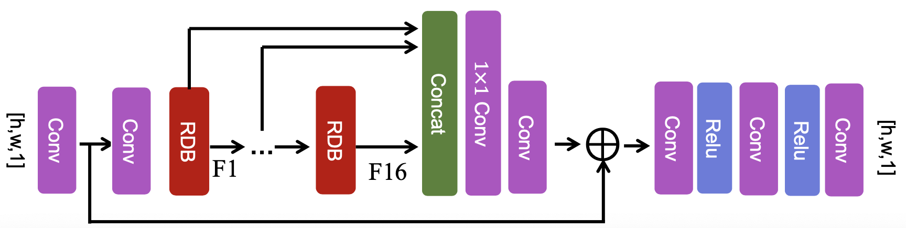
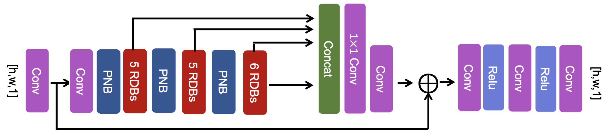
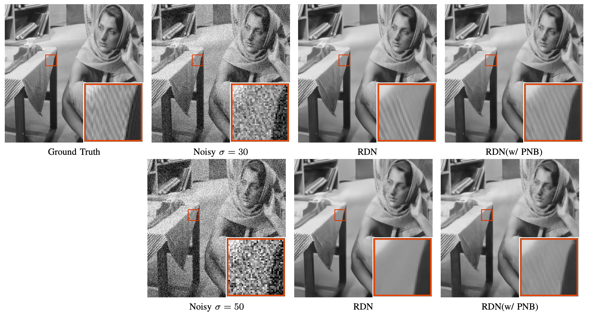
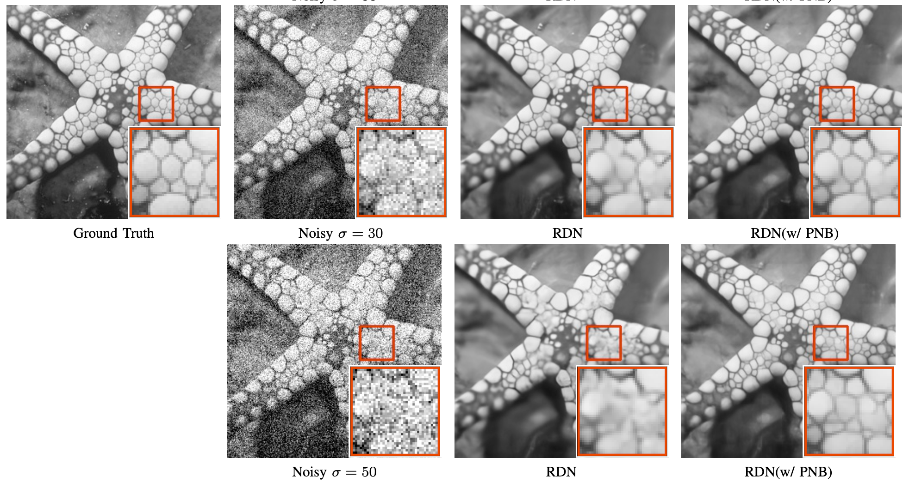

# PNEN: Pyramid Non-Local Enhanced Networks

### Introduction

We have provided pre-trained RDN model [1] and RDN-PNB model for image denoising tasks with noise level 50. The test dataset Set12, BSD68 and Urban100 are also included in this demo.

original RDN architecture [1]
<p align='center'>
  
</p>
Our proposed pyramid non-local blocks(PNB) can be easily inserted into RDN to enhance the ability to capture long-range contextual information. 
<p align='center'>
   
</p>

[1] Y. Zhang, Y. Tian, Y. Kong, B. Zhong, and Y. Fu, “Residual dense network for image restoration,” IEEE Trans. Pattern Anal. Mach. Intell. 2020.

The pre-trained checkpoint can be downloaded at [Google Drive](https://drive.google.com/drive/folders/1n0uP6JaryuglSWL5DGWlFIe-8xgEhvDq?usp=sharing). Please download them and unzip to the corresponding directory.

```bash
.
├── checkpoints
│   ├── RDN
│   ├── RDN_PNB
├── TestData
│   ├── Set12
│   ├── BSD68
│   ├── Urban100
├── test.sh
├── test.py
├── model.py
├── module.py
├── README.md
├── figures
```


### Disclaimer:
- Our code is based on Tensorflow v1.14 in Python 3.6.
- Our code has been tested on Ubuntu 16.04 and Mac.
- CPU is supported. But GPU is preferred for training.


### Usage:
```shell
sh test.sh
```

### Evaluate Performance
<p align='center'>
  
   
</p>


### Citation
If you find this benchmark helpful for your research, please consider citing:
```
@article{
}
```


